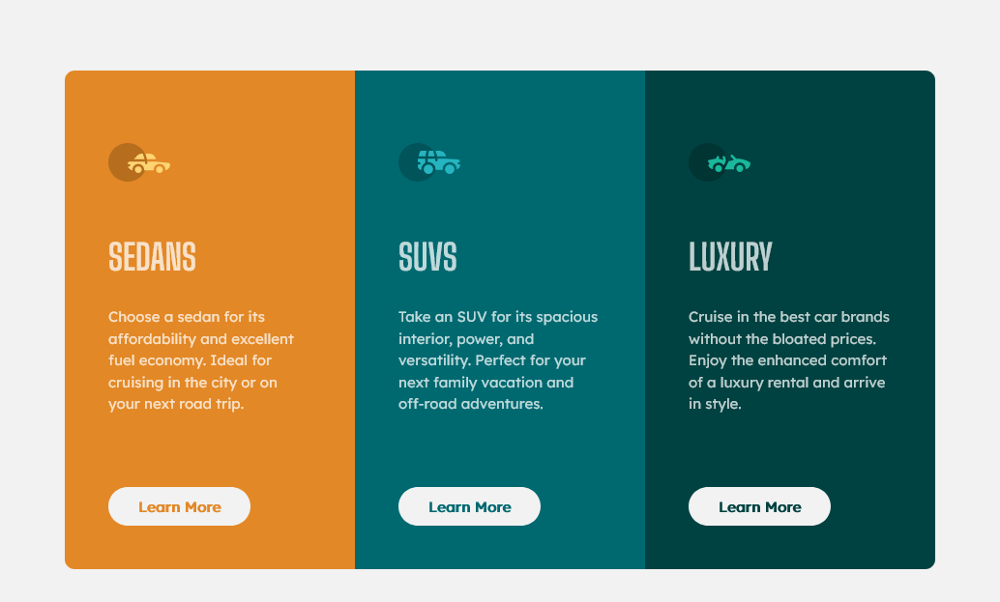

# Frontend Mentor - 3-column preview card component solution

This is a solution to the [3-column preview card component challenge on Frontend Mentor](https://www.frontendmentor.io/challenges/3column-preview-card-component-pH92eAR2-). Frontend Mentor challenges help you improve your coding skills by building realistic projects. 

## Table of contents

- [Overview](#overview)
  - [The challenge](#the-challenge)
  - [Screenshot](#screenshot)
  - [Links](#links)
- [My process](#my-process)
  - [Built with](#built-with)
  - [Useful resources](#useful-resources)
  - [What I learned](#What-I-learned)
- [Author](#author)
- [Acknowledgments](#acknowledgments)

## Overview

### The challenge

The challenge build up has been done in such a that it is reponsive between two device types the mobile and
desktop screens.

### Screenshot

- 
- 

### Links

- Solution URL: [git hub homepage](https://github.com/olisa187/3-column-card-component)
- Live Site URL: [Add live site URL here](https://your-live-site-url.com)

## My process

### Built with

- Semantic HTML5 markup
- CSS custom properties
- Flexbox
- CSS Grid
- Desktop-first workflow

### What I learned

- [Transition](https://www.w3schools.org/transition) - This helped me in adding transition effect in the learn more link or button.

## Author

- Frontend Mentor - [@oisa187](https://www.frontendmentor.io/profile/oisa187)
- Twitter - [@oisa187](https://www.twitter.com/oisa187)

## Acknowledgments

I want to acknowledge the following people or organisations for their immense contribution to my development in web development.

- Frontendmentor.io 
- Traversy.
- Kelvin Powell.
- web tutorials on web development.
